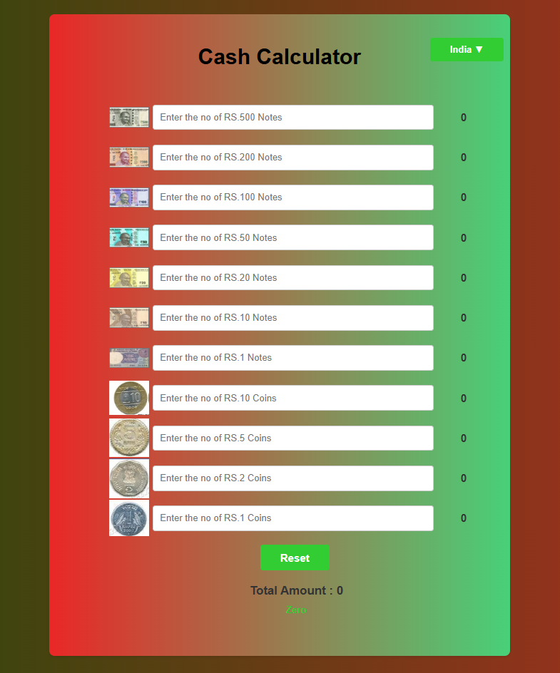
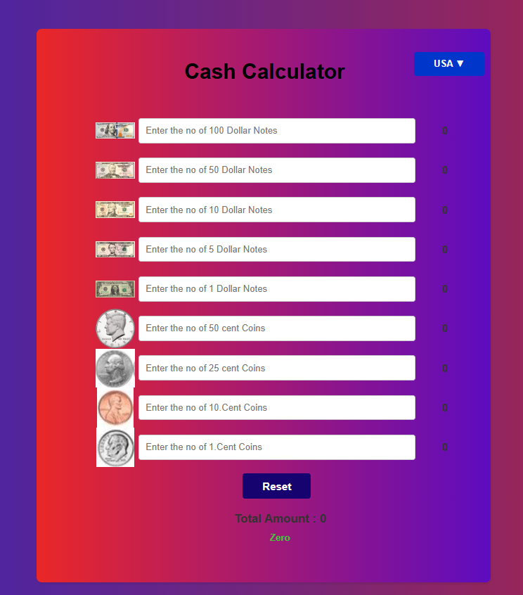

## Cash-Calculator

A simple and efficient web-based application that calculates the total value of currency notes based on user input. This project supports both Indian and US currencies and displays the result in numbers as well as words.

📌 Features

* 🧮 Calculate total cash instantly
* 💵 Supports Indian Rupee (INR) and US Dollar (USD)
* 🔢 Displays total amount in numeric format
* 🔤 Converts total into words format
* 🎨 Clean and user-friendly interface
* ⚡ Fast and responsive design

🚀 Technologies Used

* HTML – Structure of the application
* CSS – Styling and layout
* JavaScript – Logic and calculations

📂 How It Works

User enters the number of currency notes for each denomination  
Application calculates the total value automatically

Displays:
Total amount in numbers  
Total amount in words

💡 Example

If the user enters: 
158 -> 200 Notes  
346 -> 100 Notes

👉 Total Output: 
Numbers: 66,200  
Words: Sixty Six Thousand Two Hundread Rupees
